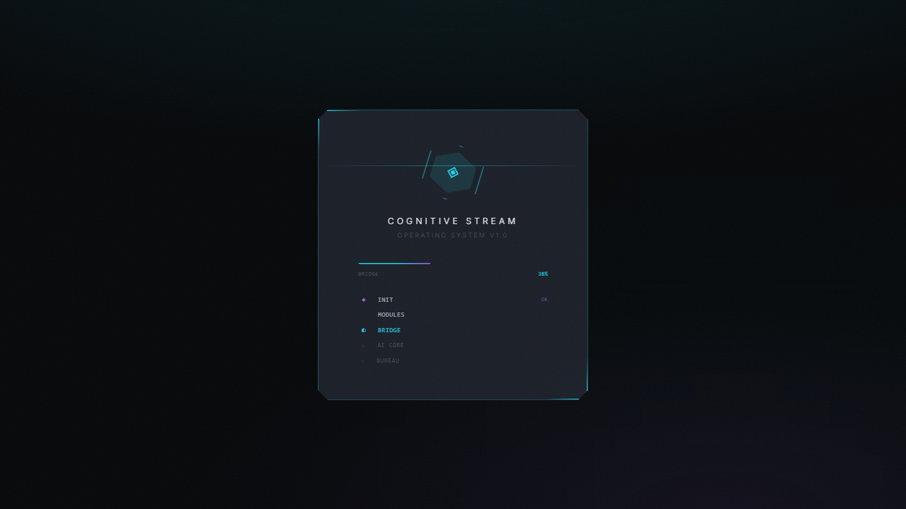

# Cognitive Stream



## Overview
Cognitive Stream is an advanced AI-powered desktop environment and cognitive interface built with React, TypeScript, Electron, and Supabase. It features a futuristic desktop experience with an integrated AI brain, file explorer, voice input, and real-time cognitive processing.

## Features
- **Cognitive Desktop Environment**: Futuristic desktop UI with icons, taskbar, sidebar, and widgets
- **AI Brain Integration**: Multi-provider AI orchestration (DeepSeek, Groq, Ollama, OpenRouter, Poe, Lovable)
- **Voice Input**: Web Speech API and Edge TTS integration
- **File Explorer**: Full-featured file manager with tabs, context menus, and preview panel
- **Real-time Chat**: Cognitive chat interface with typing indicators and notifications
- **Autonomy Engine**: Self-continuing task execution and planning
- **Electron Support**: Desktop app with native window controls and IPC bridge
- **Supabase Backend**: Real-time database, auth, and edge functions
- **Sound Effects**: Interactive UI feedback with Epidemic Sound assets
- **Theme System**: Dark/light theme with toggle support

## Technology Stack
- **React 18** - UI library
- **TypeScript** - Type safety
- **Vite** - Build tool and dev server
- **Electron** - Desktop application framework
- **Tailwind CSS** - Styling
- **shadcn/ui** - Component library
- **Supabase** - Backend, database, and real-time
- **Vitest** - Testing framework
- **DeepSeek / Groq / Ollama / OpenRouter / Poe** - AI providers

## Project Structure
```
cognitive-stream/
├── electron/           # Electron main process and preload
├── src/
│   ├── components/
│   │   ├── cognitive/  # AI cognitive interface components
│   │   ├── desktop/    # Desktop shell components
│   │   ├── explorer/   # File explorer components
│   │   └── ui/         # shadcn/ui components
│   ├── hooks/          # Custom hooks (brain, TTS, file ops, etc.)
│   ├── lib/            # AI providers, system actions, utilities
│   ├── pages/          # Desktop, Index, Settings pages
│   ├── i18n/           # Internationalization
│   └── integrations/   # Supabase client
├── supabase/           # Config, migrations, edge functions
├── scripts/            # Dev and build scripts
├── public/             # Static assets and sounds
└── tests/              # Integration tests
```

## Getting Started

### Prerequisites
- Node.js 20+
- npm 10+

### Installation
```bash
git clone <repository-url>
cd cognitive-stream
npm install
```

### Development (Web)
```bash
npm run dev
```

### Development (Desktop)
```bash
npm run dev:desktop
```

### Build
```bash
npm run build
npm run build:desktop
```

### Test
```bash
npm run test
```

## Screenshots


## License
MIT